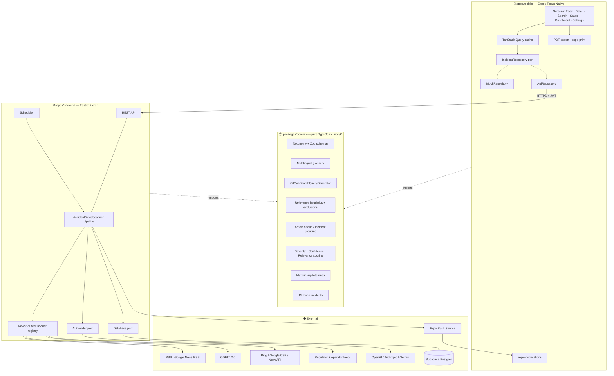
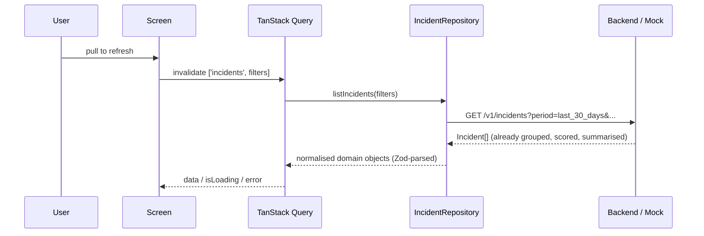
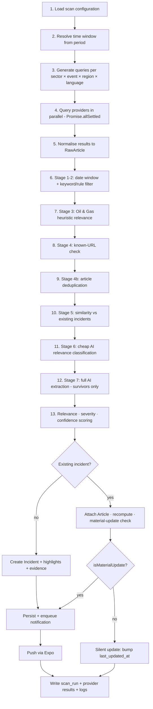
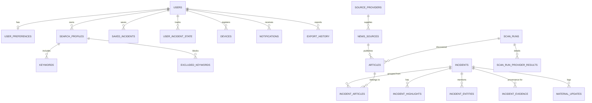
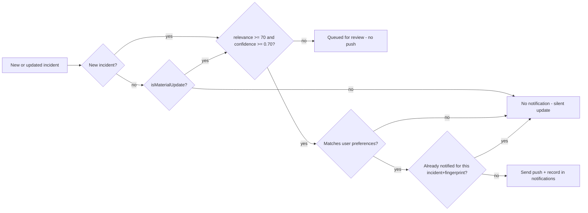

# Oil & Gas Incident Intelligence — Architecture

> Status: MVP (v0.1). This document is normative: if code and document disagree, the code is a bug.

---

## 1. Architecture overview

The product is an **incident intelligence platform**, not a news reader. The central object of the
system is the **Incident** — a real-world event — and news articles are merely *evidence* pointing
at it. Everything in the architecture follows from that inversion:

```
many Articles (evidence)  ──grouping──▶  one Incident (fact)  ──rendering──▶  Feed / Detail / PDF
```

Three deployable units plus a shared core:

| Unit | Path | Runtime | Responsibility |
|---|---|---|---|
| Mobile app | `apps/mobile` | Expo / React Native / TS | Feed, incident detail, search, saved, dashboard, settings, PDF, sharing, push receipt |
| Scanner backend | `apps/backend` | Node 20+ / Fastify / TS | Scheduled + on-demand scanning, provider orchestration, AI calls, dedup, persistence, push send |
| Database | `supabase/` | Postgres (Supabase) | Durable store, RLS, full-text + trigram indexes, history |
| Domain core | `packages/domain` | Pure TS (no I/O) | Taxonomy, Zod schemas, glossary, query generation, heuristics, dedup, grouping, scoring, material-update rules, mock dataset |



---

## 2. Important decisions (ADR-style, condensed)

Full rationale in [`docs/DECISIONS.md`](docs/DECISIONS.md). Summary:

| # | Decision | Why |
|---|---|---|
| D1 | **Node.js (Fastify) scanner service instead of Supabase Edge Functions** | The brief allows this "with a documented technical reason". A full scan fans out to dozens of providers and LLM calls and routinely exceeds edge wall-clock/CPU budgets; it needs retries, a circuit breaker, in-process caching and long-lived cron. Node also lets mobile, backend and tests import the *same* TypeScript domain package — impossible without duplication across a Deno edge runtime. Supabase is still the database, auth and (optionally) storage. A thin Edge Function `scan-now` proxy is documented for teams that want the app to never talk to a second host. |
| D2 | **Shared pure-TS `packages/domain`** | The classification/dedup/scoring logic is the product. Keeping it I/O-free makes it unit-testable, deterministic, and reusable by app + server + tests. |
| D3 | **Ports & adapters for News, AI, DB, Push** | Every external dependency is behind an interface with a working Mock implementation, so the whole MVP runs with zero API keys and zero cost. |
| D4 | **Incident and Article are separate aggregates** | Required by the product: one incident, N sources. Grouping is a first-class pipeline stage, not a UI concern. |
| D5 | **Rules first, LLM second — never LLM alone** | Severity, confidence, relevance and material-update all combine deterministic rule scores with the model's opinion. A model outage degrades quality, it does not stop the pipeline. |
| D6 | **Every AI response is parsed and validated with Zod before it can touch the database** | Anti-hallucination requirement §26. Unknown ⇒ `null`, never `0`, never invented. |
| D7 | **Metadata-only ingestion** | We store headline, excerpt, publisher, URL, dates and *our own* AI summary. We never store full article bodies, never bypass paywalls, and always link to the original. |
| D8 | **`incident_date` is the primary time axis**, `published_at` is secondary | An article published today about a 6-month-old event must not appear in "last 30 days". |
| D9 | **8-stage cost ladder** | Cheap deterministic filters run first; the expensive extraction model sees only survivors (typically <10% of raw results). |
| D10 | **Mock Mode is a first-class runtime, not fixtures** | `APP_MODE=mock` / `EXPO_PUBLIC_DATA_MODE=mock` exercises the real pipeline end to end with fictional companies, clearly flagged `MOCK DATA` in the UI. |

---

## 3. Mobile architecture

```
apps/mobile
├── app/                      # expo-router file-based routes
│   ├── _layout.tsx           # providers: theme, query client, notifications, deep links
│   ├── (tabs)/               # Home · Search · Saved · Dashboard · Settings
│   ├── incident/[id].tsx     # Incident detail
│   └── settings/*            # Search settings, keywords, notifications, scanner, sources, privacy, about
└── src/
    ├── theme/                # design tokens, light + dark palettes, typography, spacing
    ├── components/           # IncidentCard, SeverityPill, ConfidencePill, FilterChips, Section, Stat...
    ├── data/                 # IncidentRepository port + MockRepository + ApiRepository
    ├── hooks/                # TanStack Query hooks (useIncidents, useIncident, useDashboard, useScan)
    ├── state/                # Zustand: UI filters, settings, saved/read/archived state
    ├── pdf/                  # HTML report builder + expo-print/expo-sharing
    └── notifications/        # registration, handlers, deep-link mapping
```

* **Server state** = TanStack Query (cache, retry, background refetch, optimistic save/archive).
* **Client state** = Zustand, only where it is genuinely client-owned (active filter chips, settings
  draft, theme override). No global store of server data.
* **Routing** = Expo Router; push notifications deep-link to `ogii://incident/<id>`.
* **Data access** is always through `IncidentRepository`; screens never call `fetch` directly.



---

## 4. Backend architecture

Layered, dependency-inverted:

```
http (Fastify routes, auth, rate limit, validation)
  └── scanner (AccidentNewsScanner — the pipeline)
        ├── news/      NewsSourceProvider adapters   (mock, rss, google-news-rss, gdelt, bing, cse, newsapi)
        ├── ai/        AIProvider adapters           (mock, openai, anthropic, gemini)
        ├── db/        Database adapters             (memory, postgres)
        └── notifications/ PushProvider adapters     (mock, expo)
  └── scheduler (cron)
  └── util (fetch with timeout/retry/backoff, circuit breaker, concurrency limiter)
```

All adapters are resolved once at boot in a tiny composition root (`src/container.ts`) from
validated env (`src/env.ts`, Zod). Nothing else reads `process.env`.

### API surface (v1)

| Method | Path | Auth | Purpose |
|---|---|---|---|
| GET | `/health` | – | Liveness + configured providers |
| GET | `/v1/incidents` | user | Feed / history with filters, sorting, pagination |
| GET | `/v1/incidents/:id` | user | Incident + articles + highlights + evidence |
| GET | `/v1/incidents/:id/report` | user | Report model used by PDF export |
| GET | `/v1/dashboard` | user | Aggregated counters and breakdowns |
| GET | `/v1/search` | user | Full-text + structured search |
| POST | `/v1/incidents/:id/state` | user | read / saved / archived / monitoring |
| GET | `/v1/scans/latest` | user | Last run summary + next scheduled run |
| POST | `/v1/scans` | admin token | **Scan Now** (async, returns `scanId`) |
| GET | `/v1/scans/:id` | user | Live progress of a scan run |
| POST | `/v1/devices` | user | Register Expo push token + preferences |
| GET | `/v1/sources` | user | Monitored sources and their tiers/health |

---

## 5. Scanning architecture



### Cost ladder (§51)

| Stage | Filter | Typical survival | Cost |
|---|---|---|---|
| 1 | Date window (`incident_date` unknown ⇒ `published_at` proxy) | 60% | free |
| 2 | Keyword / rule filter (event term **and** O&G term) | 35% | free |
| 3 | O&G heuristic scoring + hard exclusion list | 20% | free |
| 4 | URL / title / content-hash deduplication | 12% | free |
| 5 | Structural similarity to existing incidents | 10% | free |
| 6 | Lightweight AI relevance classification (small model, title+excerpt) | 7% | ~200 tok |
| 7 | Full AI extraction (only ≥ threshold candidates) | 7% | ~1.5k tok |
| 8 | Summary + highlights (once per incident, cached) | per incident | ~800 tok |

A 24-hour content-hash keyed cache sits in front of stages 6–8.

---

## 6. Provider architecture

```ts
interface NewsSourceProvider {
  readonly id: string;
  readonly kind: 'search' | 'feed' | 'regulator';
  readonly defaultTier: SourceTier;
  isAvailable(): boolean;                              // key present / feed configured
  healthCheck(): Promise<ProviderHealth>;
  searchNews(query: SearchQuery, ctx): Promise<ProviderSearchResult>;
  getArticleMetadata?(url: string): Promise<RawArticle | null>;
  normaliseResult(raw: unknown): RawArticle | null;
}
```

* Providers are **registered**, never imported directly by the pipeline.
* One provider failing never fails a scan — `Promise.allSettled` + per-provider circuit breaker.
* Legal posture: RSS/Atom feeds, official public APIs and documented search APIs only. No paywall
  bypass, no robots.txt violation, no full-text storage. See §7 of the README.

Source tiers drive confidence:

| Tier | Meaning | Examples |
|---|---|---|
| 1 | Regulator / government investigation / official operator statement | HSE, NSTA, Havtil, ANP, BSEE, PHMSA, CSB, NOPSEMA, TSB Canada |
| 2 | Major international news organisation | Reuters, Bloomberg, BBC, AP |
| 3 | Recognised Oil & Gas publication | Upstream, Energy Voice, Offshore Energy, World Oil, OGJ, Rigzone, S&P Global |
| 4 | Regional / local media | local outlets |
| 5 | Low authority / unverified | aggregators, blogs |

---

## 7. AI architecture

```ts
interface AIProvider {
  readonly id: string;
  classifyOilAndGasRelevance(input): Promise<OilGasRelevanceResult>;
  extractIncidentData(input): Promise<ExtractedIncident>;
  summarizeIncident(input): Promise<IncidentSummary>;
  generateHighlights(input): Promise<string[]>;
  compareIncidentSimilarity(a, b): Promise<IncidentSimilarityVerdict>;
  determineMaterialUpdate(existing, incoming): Promise<MaterialUpdateVerdict>;
}
```

Hard rules, enforced in code and not merely in prompts:

1. Every method returns a **Zod-validated** object. `parseAiJson(schema, text)` strips code fences,
   repairs the common trailing-comma failure, and throws `AiResponseError` on anything else.
2. Unknown facts are `null`. `0` is reserved for "the source says zero".
3. The model never decides alone: `finalSeverity = blend(ruleSeverity, aiSeverity)`,
   `finalConfidence = f(sourceTier, sourceCount, officialSource, agreement, completeness, aiConfidence)`.
4. API keys exist only in the backend process. The mobile app has no AI credentials, by construction.
5. Provider + model + prompt version + token usage are recorded per call for observability and cost
   control (never the key itself).

---

## 8. Database architecture

Postgres. 20 tables. Core relationships:



Design notes:

* Enum-like columns are `text` + `CHECK` constraints (cheap to evolve; no `ALTER TYPE` migrations).
* Every nullable fact is genuinely nullable — the schema refuses to encode "unknown" as `0`.
* `latitude`/`longitude` are present from day one so the future World Incident Map needs no
  migration; a `GIST` index is created when PostGIS is available, otherwise a btree pair.
* Dedup support: `articles.canonical_url` UNIQUE, `normalized_url` UNIQUE, `title_hash`,
  `content_hash` + `pg_trgm` GIN index on titles.
* Search support: generated `tsvector` column on incidents with a GIN index.
* RLS: user-scoped tables are locked to `auth.uid()`. Incidents/articles are readable by any
  authenticated user; only the service role writes them.

---

## 9. Deduplication strategy

Two distinct problems, two distinct algorithms.

**A. Article deduplication** (same *document*):
1. `canonical_url` exact match (after `<link rel=canonical>` / `og:url`).
2. `normalized_url` exact match — lowercase host, strip `www.`, strip `utm_*`/`fbclid`/`gclid`/
   `amp` params, strip trailing slash + `/amp`, sort remaining params.
3. `title_hash` (normalised: lowercase, diacritics folded, punctuation stripped, stop-words removed)
   **+ same publisher** within 7 days.
4. `content_hash` of `title + excerpt`.
5. Fuzzy: token-set Jaccard ≥ 0.85 **and** published within 48 h **and** same publisher family
   (catches syndication: "Reuters" vs "Reuters via Yahoo").

**B. Incident grouping** (same *event*, different documents) — weighted evidence score:

| Signal | Weight | Notes |
|---|---|---|
| Incident date within ±2 days | 0.20 | hard gate at ±7 days |
| Same country | 0.15 | mismatch is a veto |
| Same operator / company (normalised legal suffixes) | 0.20 | strong |
| Same asset / installation / field / well | 0.20 | strongest single signal when present |
| Same incident type | 0.10 | |
| Headline token-set similarity | 0.10 | |
| Shared named entities | 0.05 | |

`score ≥ 0.72` ⇒ same incident. `0.55–0.72` ⇒ ask the LLM (`compareIncidentSimilarity`) and require
its `same=true` with `confidence ≥ 0.7`. `< 0.55` ⇒ new incident. Rules gate the LLM; the LLM never
overrides a country/date veto.

---

## 10. Notification strategy



Per-user preference gates: master switch, sound, critical-only, severity floor, categories,
countries, well-integrity alerts, well-control alerts. Deduplication key is
`(user_id, incident_id, update_fingerprint)`, so a syndicated repeat can never ring twice.

---

## 11. PDF generation strategy

The report **model** is built in `packages/domain/src/report/incident-report.ts` (pure, tested,
shared). The mobile app renders that model to HTML and hands it to `expo-print` →
`printToFileAsync()` → `expo-sharing`. Same model can later feed a server-side renderer for email
digests without rewriting the layout logic. Disclaimer and "system-assessed" labelling are part of
the model, not the template, so they cannot be dropped by a styling change.

---

## 12. Security model

* **No secret ever reaches the device.** Service-role key, AI keys and news API keys live only in the
  backend process env. The app holds at most the Supabase *anon* key (designed to be public, guarded
  by RLS).
* Supabase Auth issues the JWT; the backend verifies it and derives `user_id`. Privileged endpoints
  additionally require `ADMIN_API_TOKEN`.
* All request input is Zod-validated at the HTTP boundary; all AI output is Zod-validated at the
  model boundary; all provider output is normalised through `normaliseResult`.
* URL handling is allow-listed to `http(s)`, rejecting `javascript:`, `data:`, and credentials in the
  authority. Deep links are parsed, not `eval`-ed, and the incident id is validated as a UUID.
* Rate limiting per IP and per token; structured logs redact `authorization`, `*_key`, `*_token`.
* GDPR: account deletion, personal-data export and retention settings are modelled in the schema and
  exposed under Settings → Data & Privacy.

---

## 13. Cost optimisation

* The 8-stage ladder above (deterministic filters remove ~90% before any token is spent).
* Two model tiers: a cheap model for stage 6 classification, a stronger model for stage 7 extraction.
* Content-hash cache (24 h) for classification, extraction and summarisation.
* `SCAN_MAX_AI_EXTRACTIONS` hard cap per run — the scanner degrades gracefully rather than
  overspending, and records `budget_exhausted` in the run log.
* Summaries/highlights regenerate only when a *material* update lands, not on every republication.

---

## 14. Future roadmap (architecture already prepared)

| Feature | What is already in place |
|---|---|
| World incident map / heat map | `latitude`, `longitude`, `basin`, `block` columns + geo index hook |
| Trends & analytics | immutable `scan_runs`, dated incidents, normalised operators/countries |
| Operator / asset / well watchlists | `incident_entities` table keyed by entity type + normalised name |
| Daily & weekly digests | notification pipeline is queue-shaped; a digest is another consumer |
| Email / Teams / Slack alerts | `PushProvider` port — add adapters, no pipeline change |
| Regulatory intelligence | `source_providers.kind = 'regulator'` + Tier 1 handling already modelled |
| Multi-user organisations | `users` is referenced, not embedded; add `organisations` + membership |
| Lessons learned / pattern detection | `incident_evidence` keeps per-field provenance for training data |
